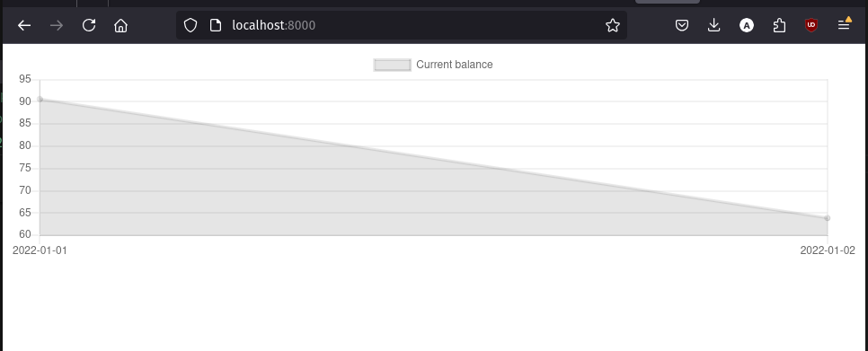

# House Accounting

Self-hosted web application to help you manage your personal finance and analyze where your spending.

## Initialize and run project

```bash
git clone git@github.com:imranariffin/house-accounting.git
cd house-accounting/
uv sync
./manage migrate
./manage p
./manage runserver
# Go to https://localhost:8000/
```

You will see something like this (For now. Please excuse the bad, empty UI):



## Architecture

See [Architecture Page](docs/ARCHITECTURE.md)
